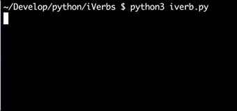
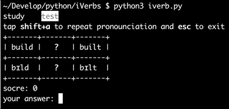

🎧 iVerbs (version audio)
=========================

The script allows you to study and train **irregular verbs**. Moreover, this version includes an audio file with pronunciation three forms and IPA (International Phonetic Alphabet) for every verb.

There are three games:

* see, listening and repeat
* see, listening and fill in an empty cell
* listening and write all three forms of a verb

Quickstart
==========

.. code:: bash

	git clone https://github.com/turneps403/iVerbs.git
	cd iVerbs
	pip3 install -r requirements.txt
	python3 iverb.py

Study mode
==========

Test mode
=========

Changelog
=========

2.1 - 2018-12-04
__________________

* Added listening game

2.0 - 2018-12-03
------------------

* Version audio

1.0 - 2018-11-27
------------------

* Initial release 

