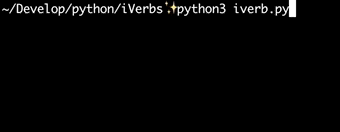
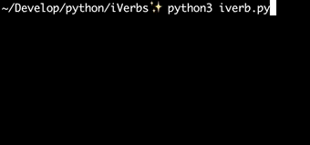

iVerbs 🔊
======

Time for real things.
 
Please, meet with **console trainer** irregular verbs. Don't think you aren't too cool for this. You are cool. Give yourself some irregular verbs with IPA (International Phonetic Alphabet). 

.. role:: raw-role(raw)
   :format: html latex

Are you going to study it? Do it right :raw-role:`<strike> now </strike>`, :raw-role:`<strike> today </strike>` or maybe this week.

Quickstart
==========

.. code:: bash

	git clone https://github.com/turneps403/iVerbs.git
	cd iVerbs
	pip3 install -r requirements.txt
	python3 iverb.py

Study mode
==========

Test mode
=========

Changelog
=========

1.0.0 - 2018-11-27
------------------

* Initial release.

